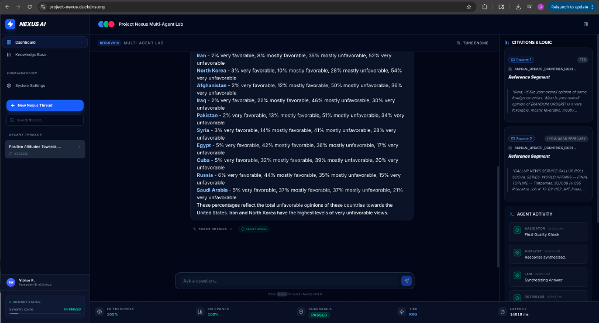
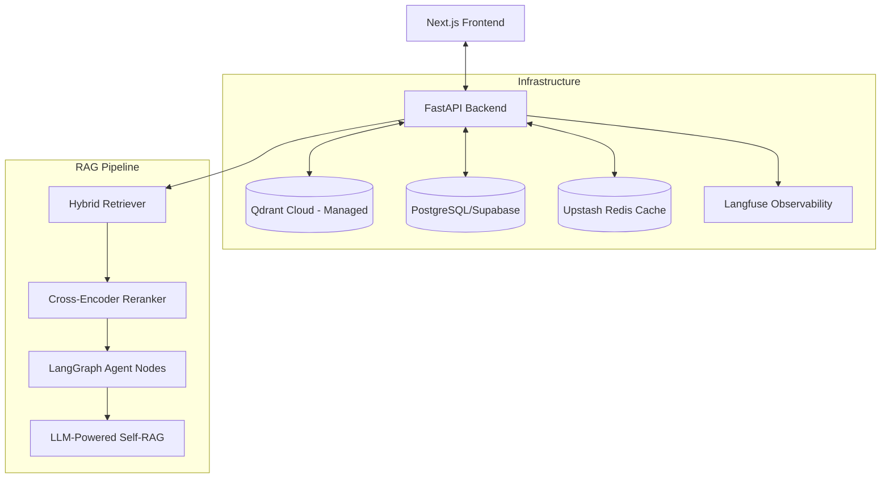

# Project NEXUS — Multi-Agent Research Intelligence Platform

> A production-grade Applied AI system featuring adaptive RAG, multi-agent orchestration via LangGraph, hybrid retrieval (Dense + Sparse), cross-encoder reranking, and full observability.



---

## 🚀 Production Infrastructure (AWS/Terraform)

Project Nexus is optimized for high-availability while maintaining a minimal compute budget using a modern containerized stack on AWS. Infrastructure is provisioned via **Terraform** for full automation and reproducibility.

> See the [Provisioning Guide](docs/NEXUS_README.md#13-infrastructure-provisioning-terraform) for detailed setup instructions.



### Stack Detail
- **Backend**: Python 3.12 / FastAPI (Containerized on Amazon ECR)
- **Frontend**: Next.js 15 (Containerized on Amazon ECR)
- **CI/CD**: GitHub Actions (Automated Lint, Test, Build, and AWS SSM Deployment)
- **Databases**: Supabase `[ACTIVE]`, Qdrant (Vector) `[ACTIVE]`, Upstash (Redis Cache) `[ACTIVE]`
- **Observability**: Langfuse (Tracing, Cost, and RAGAS Evaluations)

---

## 🧬 Key Technical Features

### 1. Multi-Agent Orchestration (LangGraph) `[ACTIVE]`
Uses a directed cyclic graph to manage stateful, multi-turn agent interactions. The system dynamically transitions between `Researcher`, `Analyst`, and `Validator` nodes to ensure grounded responses.

### 2. Hybrid Retrieval & Reranking `[ACTIVE]`
- **Dense Retrieval**: `sentence-transformers/all-MiniLM-L6-v2` for semantic similarity.
- **Sparse Retrieval**: BM25/Supabase RPC for keyword matching.
- **Cross-Encoder Reranker**: `cross-encoder/ms-marco-MiniLM-L-6-v2` re-scores candidates to minimize irrelevant context insertion.

### 3. LLM-Powered Self-RAG (Hallucination Gate) `[ACTIVE]`
A specialized validation layer that uses `gpt-4o-mini` to check generated claims against retrieved context, preventing "hallucinated" answers from reaching the end-user.

---

## 🏗️ Architectural Rationale: Cost-Optimized Validation

A core design decision in Nexus AI was the pivot from **Local NLI** to **LLM-based Validation** for the Self-RAG layer.

### The Problem: The "RAM Tax"
Our initial blueprint called for `cross-encoder/nli-deberta-v3-small` running locally. However:
- **Compute Overhead:** Loading this model requires ~1.5GB of dedicated RAM.
- **Cost Impact:** On AWS, this would necessitate a `t3.medium` or larger instance (approx. $30/mo) or higher-memory Fargate tasks.
- **Cold Starts:** Smaller instances or serverless runners could take up to 20 seconds to load the model on first request.

### The Solution: LLM-as-a-Validator
We implemented the `Validator` node using a specialized prompt on `gpt-4o-mini`:
- **Financial Efficiency:** At $0.15/1M tokens, 1,000 validation checks cost less than **$0.10**. This allows us to stay on a **t3.micro/small** ($10-15/mo) instance while maintaining production-grade validation.
- **Observability:** Unlike local NLI which returns a single float (`0.0 - 1.0`), the LLM returns **structured JSON** explaining *why* a claim failed, which we surface in the UI.
- **Stability:** Significant gains in system stability (zero OOM crashes on small instances).

---

## 🛠️ Developer Setup

### Prerequisites
- Python 3.12+
- Node.js 18+
- Docker & Docker Compose (Optional, for prod simulation)

### 1. Backend (FastAPI)
```bash
cd backend
python -m venv .venv
source .venv/bin/activate  # On Windows: .venv\Scripts\activate
pip install -r requirements.txt
python -m uvicorn main:app --reload
```
*Note: Copy `.env.example` to `.env` and fill in your keys.*

### 2. Frontend (Next.js)
```bash
cd frontend
npm install
npm run dev
```

---

*Developed by [Vibhor](https://github.com/bellerophon95)*
