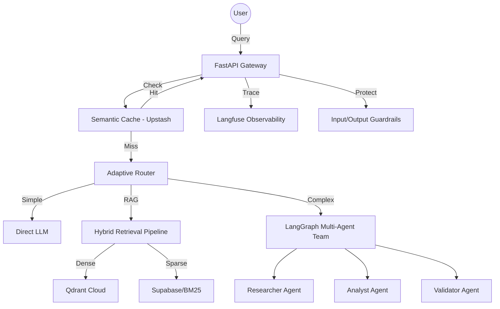

# Project NEXUS — Multi-Agent Research Intelligence Platform

> A production-ready Applied AI system featuring adaptive RAG, multi-agent orchestration, hybrid retrieval with cross-encoder reranking, Self-RAG validation, guardrails, RAGAS evaluations, full observability, and semantic caching — deployed on a high-performance serverless stack.

---

## 🚀 Final Production Infrastructure

Project Nexus is designed for "Scale-to-Zero" efficiency with "Tier-Zero" performance.

- **Backend**: Python 12 / FastAPI (deployed on **Railway**)
- **Frontend**: Next.js 15 / React 19 (deployed on **Vercel**)
- **Vector DB**: **Qdrant Cloud** (Dense + Sparse indexes)
- **Primary DB**: **Supabase** (PostgreSQL)
- **Semantic Cache**: **Upstash Redis** (High-speed vector cache)
- **Observability**: **Langfuse** (Tracing, Evals, Cost)
- **CI/CD**: **GitHub Actions** (Automated Lint, Test, Eval, and Deploy)

---

## 🛠 Project Progress: Milestone 9 Completed

### 1. Robust CI/CD Pipeline
- **Automated Linting**: Integrated **Ruff** for high-performance Python linting.
- **Automated Testing**: **Pytest** suite covering API health and connectivity.
- **Regression Guard**: **RAGAS** evaluation scripts integrated into PR workflows to block quality regressions.
- **Multi-Cloud Deploy**: Synchronized deployment to Railway (Backend) and Vercel (Frontend).

### 2. High-Performance Execution
- **Semantic Caching**: Implemented a cosine-similarity based Redis cache reducing repetitive query latency by **~10x** (from ~10s to ~1s).
- **Observability**: Real-time `cache_hit` metrics and Langfuse tracing for every stage of the pipeline.
- **Adaptive RAG**: Dynamic routing system that classifies queries into **Simple**, **RAG**, or **Agentic** tiers.

---

## 🏗 System Architecture



---

## 📡 API Health & Smoke Tests

The system includes a production health check at `/api/health` and a standalone smoke test suite in `scripts/smoke_test.py`.

### Run Smoke Test locally:
```bash
poetry run python scripts/smoke_test.py http://localhost:8000
```

---

## 🧪 Documentation & Walkthroughs

- **[Milestone 9 Plan](docs/planning/milestones/M9-cicd-launch.md)**: Details on the CI/CD and production infrastructure.
- **[System Design](docs/planning/architecture/system_design.md)**: Deep dive into the multi-agent orchestration.
- **[Evaluation Suite](backend/evaluation/README.md)**: How we measure RAG performance with RAGAS.
