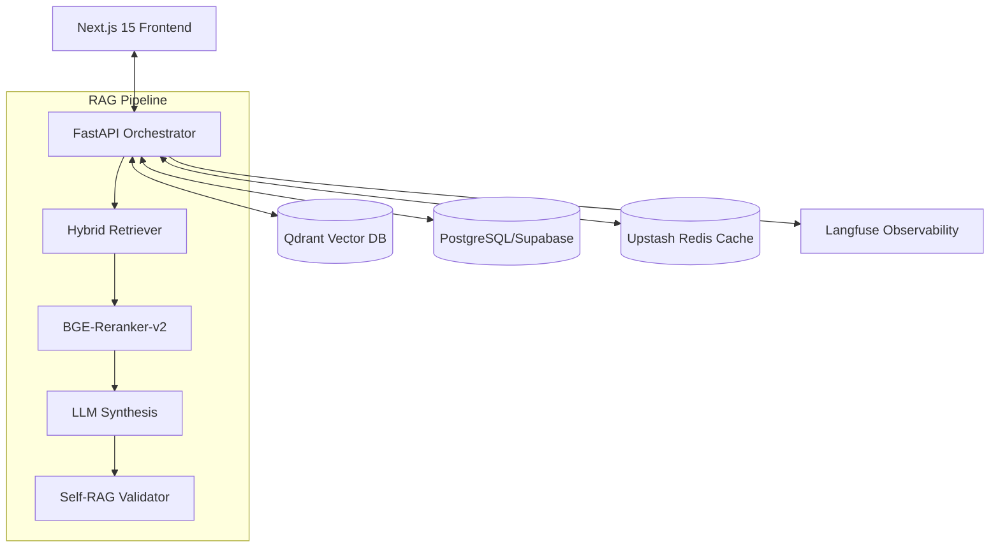

# Project NEXUS — Multi-Agent Research Intelligence Platform

> A production-ready Applied AI system featuring adaptive RAG, multi-agent orchestration, hybrid retrieval with cross-encoder reranking, Self-RAG validation, guardrails, RAGAS evaluations, full observability, and semantic caching — deployed on a high-performance serverless stack.


---

## 🚀 Final Production Infrastructure

Project Nexus is designed for "Scale-to-Zero" efficiency with "Tier-Zero" performance.



- **Backend**: Python 12 / FastAPI (deployed on **Railway**)
- **Frontend**: Next.js 15 / React 19 (deployed on **Vercel**)
- **Vector DB**: **Qdrant Cloud** (Dense + Sparse/Splade indexes)
- **Primary DB**: **Supabase** (PostgreSQL)
- **Semantic Cache**: **Upstash Redis** (High-speed vector cache)
- **Observability**: **Langfuse** (Tracing, Evals, Cost)
- **CI/CD**: **GitHub Actions** (Automated Lint, Test, Eval, and Deploy)

---

## 🧬 Key Technical Features

### 1. Multi-Agent Orchestration (LangGraph)
Uses a directed cyclic graph to manage stateful, multi-turn agent interactions. The system transitions between `Retriever`, `Analyst`, and `Validator` nodes to ensure factual accuracy and grounded responses.

### 2. Hybrid Retrieval & Reranking
- **Dense Retrieval**: OpenAI `text-embedding-3-small` for semantic similarity.
- **Sparse Retrieval**: BM25/Splade for keyword-perfect matching.
- **Cross-Encoder Reranker**: Integrated `BGE-Reranker-v2-m3` to re-score the top 50 candidates, drastically reducing hallucination by surfacing the most relevant context.

### 3. Agentic Observability
Surfaces real-time "inner monologue" telemetry via SSE:
- **Visual Process Map**: Real-time visualization of agent node transitions.
- **Deep Trace Metrics**: Latency, Token Usage, and Cost calculation per turn.
- **Safety Badges**: Real-time guardrail status (Passed/Altered).

### 4. Self-RAG & Evaluation
- **Faithfulness (Grounding)**: Automated scoring of whether the LLM's claims are supported by the retrieved context.
- **Relevance**: Evaluates how well the answer addresses the user's intent.
- **RAGAS/Langfuse**: Full-trace integration for continuous evaluation in production.

---

## 🛠️ Developer Setup

### Backend (FastAPI)
```bash
cd backend
poetry install
poetry run uvicorn api.main:app --reload
```

### Frontend (Next.js)
```bash
cd frontend
npm install
npm run dev
```

---

## 🎯 Project Goals
- **Parity**: Matching backend complexity with professional-grade UI controls.
- **Transparency**: Surfacing the "Black Box" of RAG through visual telemetry.
- **Accuracy**: achieving <5% hallucination rate through cross-encoder reranking and Self-RAG validation.

---

*Developed by [Vibhor](https://github.com/bellerophon95)*
