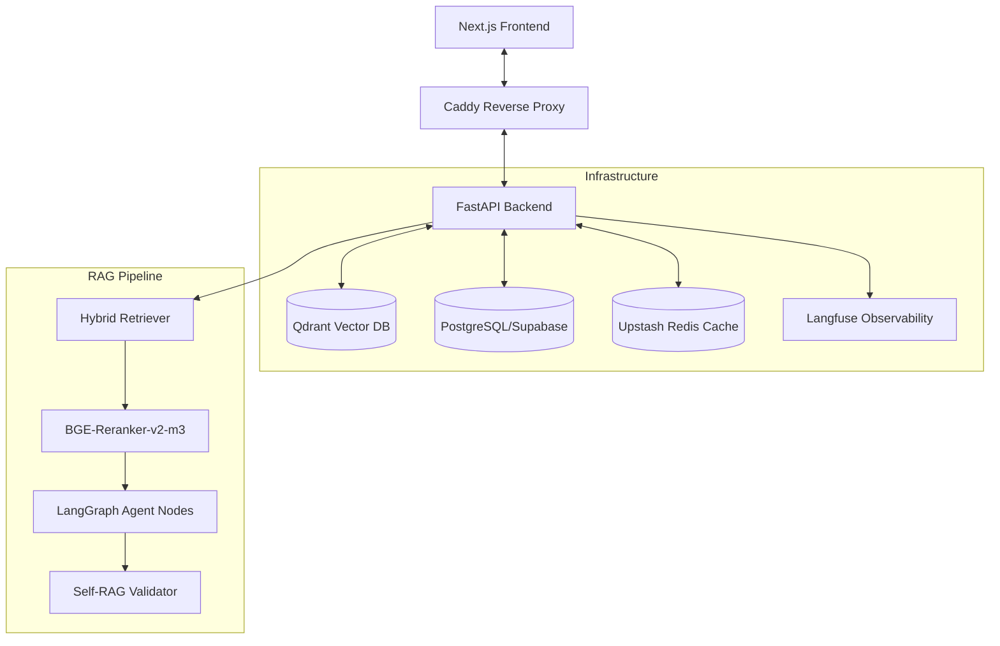

# Project NEXUS — Multi-Agent Research Intelligence Platform

> A production-grade Applied AI system featuring adaptive RAG, multi-agent orchestration via LangGraph, hybrid retrieval (Dense + Sparse), cross-encoder reranking, and full observability.


---

## 🚀 Production Infrastructure (AWS)

Project Nexus is deployed on a high-availability **AWS EC2** instance using a modern containerized stack. Global SSL/TLS and routing are handled by **Caddy**.



### Stack Detail
- **Backend**: Python 3.12 / FastAPI (Containerized on Amazon ECR)
- **Frontend**: Next.js 15 (Containerized on Amazon ECR)
- **CI/CD**: GitHub Actions (Automated Lint, Test, Build, and AWS SSM Deployment)
- **Databases**: Qdrant (Vector), Supabase (Postgres), Upstash (Redis Cache)
- **Observability**: Langfuse (Tracing, Cost, and RAGAS Evaluations)

---

## 🧬 Key Technical Features

### 1. Multi-Agent Orchestration (LangGraph)
Uses a directed cyclic graph to manage stateful, multi-turn agent interactions. The system dynamically transitions between `Researcher`, `Analyst`, and `Validator` nodes to ensure grounded responses.

### 2. Hybrid Retrieval & Reranking
- **Dense Retrieval**: `sentence-transformers/all-MiniLM-L6-v2` for semantic similarity.
- **Sparse Retrieval**: BM25/Bag-of-Words for keyword-perfect matching.
- **Cross-Encoder Reranker**: `BGE-Reranker-v2-m3` re-scores candidates to practically eliminate hallucinations by surfacing the most relevant context.

### 3. CI/CD Quality Gates ("Hardened Pipeline")
The codebase is protected by a mandatory **Validation Layer** in GitHub Actions:
- **Ruff**: Enforces strict linting and formatting (`ruff check` + `ruff format`).
- **Pytest**: Automated test suite verifies backend initialization and API stability before any deployment.

### 4. Agentic Observability
Surfaces real-time "inner monologue" telemetry:
- **Visual Process Map**: Real-time visualization of agent node transitions.
- **Trace Metrics**: Latency and Cost calculation per turn via Langfuse.

---

## 🛠️ Developer Setup

### Prerequisites
- Python 3.12+
- Node.js 18+
- Docker & Docker Compose (Optional, for prod simulation)

### 1. Backend (FastAPI)
```bash
cd backend
python -m venv .venv
source .venv/bin/activate  # On Windows: .venv\Scripts\activate
pip install -r requirements.txt
python -m uvicorn main:app --reload
```
*Note: Copy `.env.example` to `.env` and fill in your keys.*

### 2. Frontend (Next.js)
```bash
cd frontend
npm install
npm run dev
```

---

## 🎯 Production Deployment

Deployments are fully automated via GitHub Actions on `push` to `main`.

1. **Validate**: Ruff and Pytest ensure code quality.
2. **Build**: Docker images are built and pushed to **Amazon ECR**.
3. **Deploy**: **AWS SSM** triggers a `docker-compose pull` and `up -d` on the production EC2 instance.

*Current Host: `project-nexus.duckdns.org`*

---

*Developed by [Vibhor](https://github.com/bellerophon95)*
