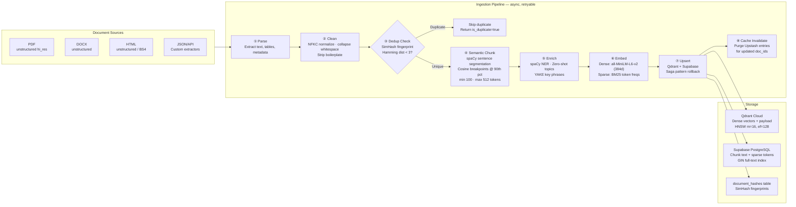
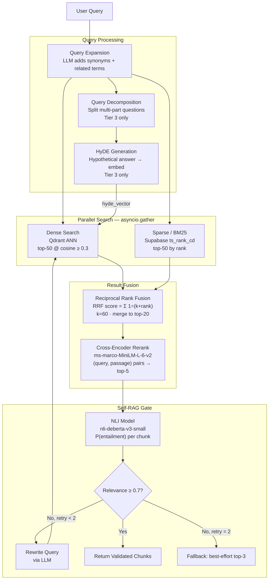
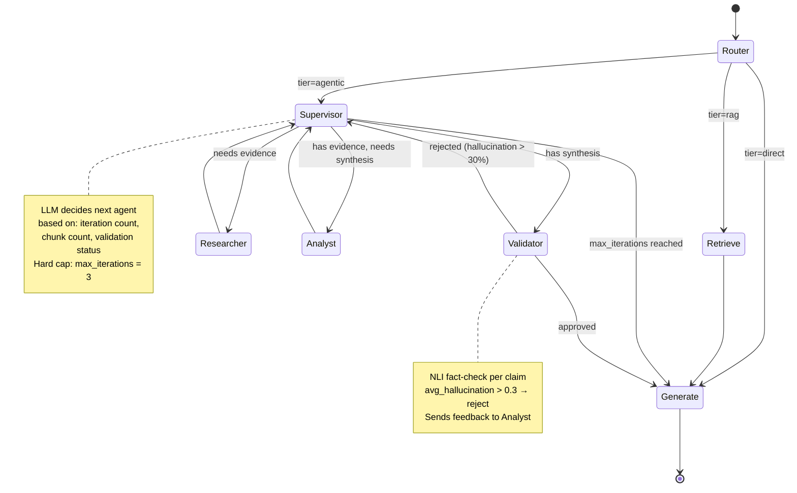
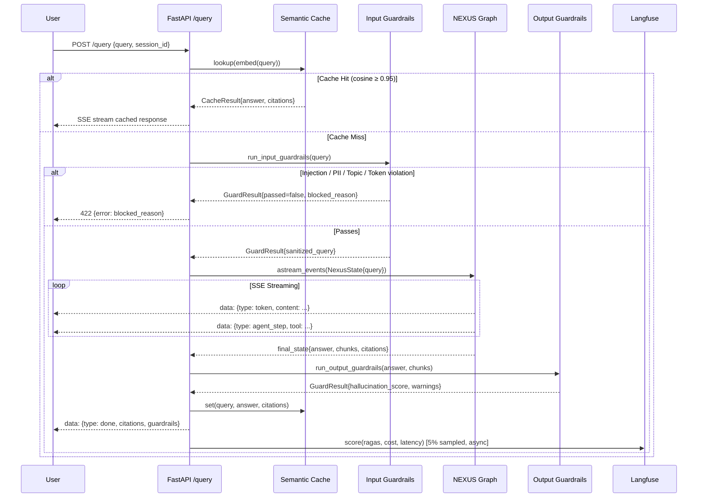
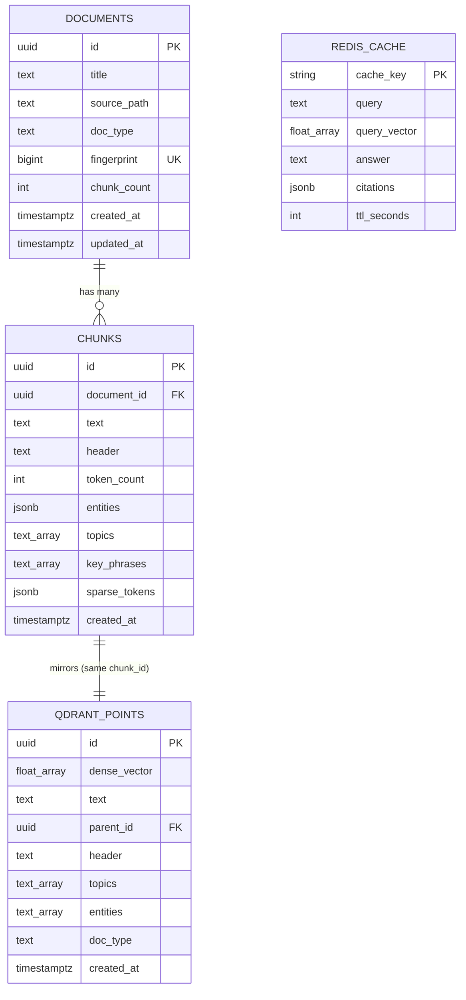
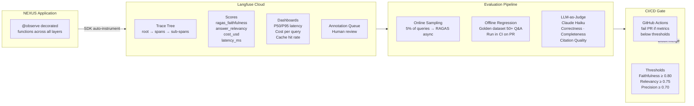
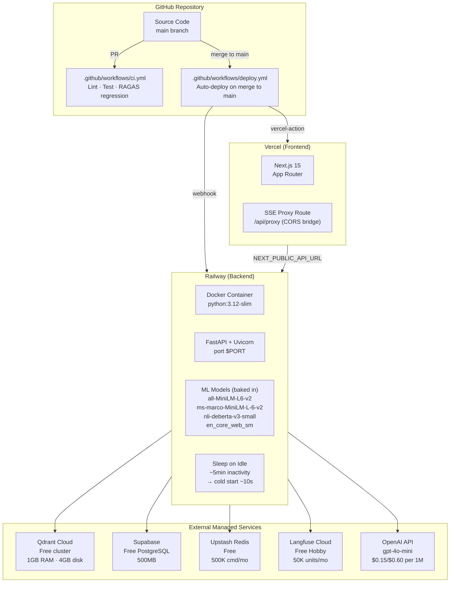
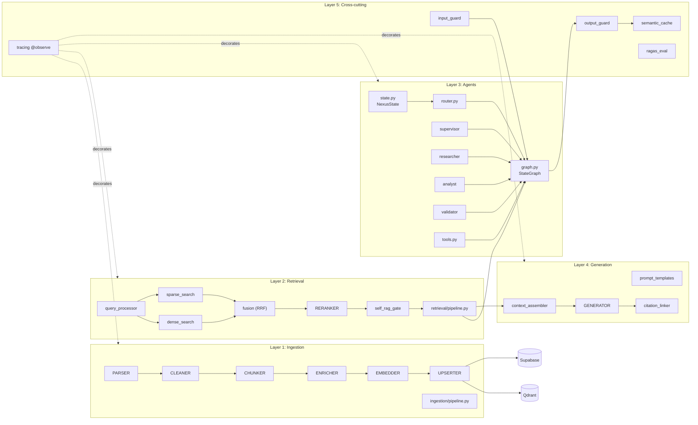

# NEXUS System Design — v1

> Version: `v1.0.0` | Date: 2026-03-27 | Status: Approved for Implementation

---

## 1. High-Level Architecture

```mermaid
graph TB
    subgraph CLIENT["Client Layer"]
        UI["Next.js Frontend\nVercel"]
        UPLOAD["Document Upload\nDrag & Drop"]
    end

    subgraph API["API Layer — FastAPI on Railway"]
        direction TB
        HEALTH["GET /api/health"]
        INGEST_EP["POST /api/ingest"]
        QUERY_EP["POST /api/query\nSSE Stream"]
        MW["Middleware\nRate Limit · CORS · Error Handler"]
    end

    subgraph CACHE["Semantic Cache"]
        REDIS["Upstash Redis\nVector Similarity≥0.95"]
    end

    subgraph GUARD_IN["Input Guardrails"]
        INJ["Prompt Injection\nllm-guard"]
        PII_IN["PII Anonymizer\npresidio"]
        TOPIC["Topic Restriction\nBanTopics"]
        TOK["Token Budget\n≤4096 tokens"]
    end

    subgraph PIPELINE["NEXUS Query Pipeline"]
        ROUTER["Adaptive Router\nTier 1 · 2 · 3"]
        RETR["Hybrid Retrieval\nPipeline"]
        AGENTS["Agent Orchestration\nLangGraph"]
        GEN["Generation Engine\ngpt-4o-mini"]
    end

    subgraph GUARD_OUT["Output Guardrails"]
        HALLUC["Hallucination Score\nNLI ≥0.5 → warn"]
        CIT_V["Citation Verify"]
        TOX["Toxicity Filter\nllm-guard"]
        PII_OUT["PII Leak Detect\npresidio"]
    end

    subgraph OBS["Observability — Langfuse"]
        TRACE["Distributed Traces\n@observe"]
        COST["Cost Tracker\nper-model token cost"]
        EVAL["RAGAS + LLM-Judge\n5% online sampling"]
        ALERT["Drift Alerts\nWebhook"]
    end

    UI -->|Query + session_id| QUERY_EP
    UPLOAD -->|UploadFile| INGEST_EP
    QUERY_EP --> MW
    INGEST_EP --> MW
    MW --> CACHE
    CACHE -->|Cache Miss| GUARD_IN
    GUARD_IN -->|Sanitized Query| PIPELINE
    PIPELINE -->|Answer + Citations| GUARD_OUT
    GUARD_OUT -->|SSE Stream| UI
    GUARD_OUT --> CACHE
    PIPELINE -.->|@observe| OBS
    GUARD_IN -.->|@observe| OBS
    GUARD_OUT -.->|@observe| OBS
```

---

## 2. Document Ingestion Pipeline



---

## 3. Hybrid Retrieval Pipeline



---

## 4. Agent Orchestration — LangGraph StateGraph



---

## 5. Generation + Guardrail Pipeline (Full Query Flow)



---

## 6. Data Model & Storage Architecture



---

## 7. Observability & Evaluation Architecture



---

## 8. Deployment & Infrastructure Topology



---

## 9. Component Dependency Map



---

## Version History

| Version | Date | Description |
|---|---|---|
| v1.0.0 | 2026-03-27 | Initial system design — full NEXUS architecture |
